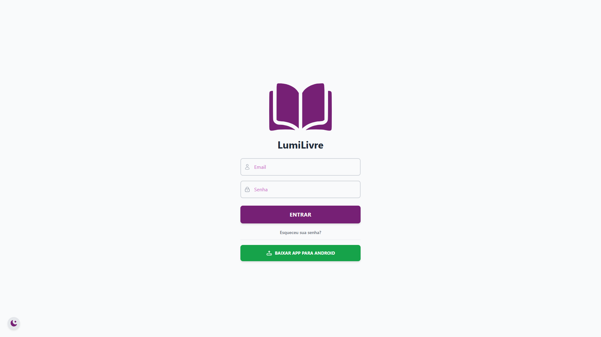
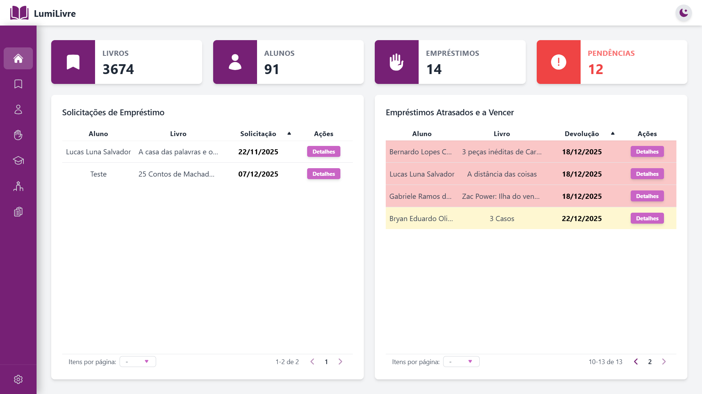
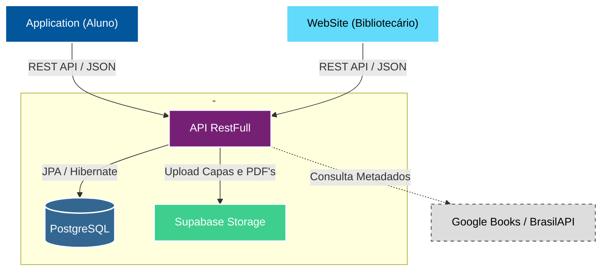

  <!-- Banner -->
  

  <!-- Pins-->
  
  
  

 

  <h1>Sobre o Projeto</h1>

O **LumiLivre Web** é o painel administrativo central do ecossistema, voltado para **bibliotecários e gestores**. Desenvolvido em **React** com **TypeScript**, ele oferece uma interface robusta e responsiva para o gerenciamento completo do acervo, usuários e fluxo de empréstimos.

A aplicação foi construída com foco em produtividade, utilizando **TailwindCSS** para estilização moderna e **React Query** para gerenciamento eficiente de estado e cache, garantindo que os dados administrativos estejam sempre sincronizados com o backend.

 

  <h1>Screenshots</h1>

  
  

 

  <h1>Funcionalidades Principais</h1>

### 📊 Dashboard & Gestão
- **Visão Geral:** Métricas em tempo real sobre empréstimos ativos, atrasos e solicitações pendentes.
- **Controle de Acervo:** Cadastro completo de livros (com busca automática de metadados via ISBN), exemplares físicos e TCCs.
- **Gestão de Usuários:** Administração de alunos, cursos, turnos e módulos, com histórico detalhado de cada leitor.

### 🔄 Fluxo de Empréstimos
- **Solicitações:** Aprovação ou rejeição de pedidos de empréstimo feitos pelo aplicativo mobile.
- **Movimentação:** Registro de retiradas e devoluções, com cálculo automático de datas de vencimento.
- **Penalidades:** Sistema automático de bloqueio para alunos com devoluções em atraso.

### 📑 Relatórios & Ferramentas
- **Relatórios PDF:** Geração de documentos detalhados sobre acervo, alunos e movimentações para fins administrativos.
- **Ranking:** Visualização dos alunos que mais leem (Gamificação vista pelo lado do gestor).
- **Importação em Massa:** Ferramenta para carga de dados via planilhas Excel.

### ⚙️ Recursos Técnicos
- **Dark Mode:** Suporte nativo a temas claro e escuro (`ThemeContext`).
- **Performance:** Paginação dinâmica e cache de requisições com TanStack Query.
- **Responsividade:** Layout adaptável para desktops e tablets.

 

  <h1>Arquitetura do Sistema</h1>

Utilizamos uma arquitetura cliente-servidor moderna baseada em microsserviços e nuvem para garantir escalabilidade.

 

  <h1>Segurança</h1>

- **Rotas Protegidas:** Implementação de `ProtectedRoute` para impedir acesso não autorizado às páginas administrativas.
- **Gestão de Sessão:** Controle de autenticação via Context API (`AuthContext`) com persistência segura e logout automático.
- **Validação de Dados:** Tratamento rigoroso de formulários e respostas da API para prevenir injeção de dados inválidos.

 

  LumiLivre © 2025 - Todos os direitos reservados.

