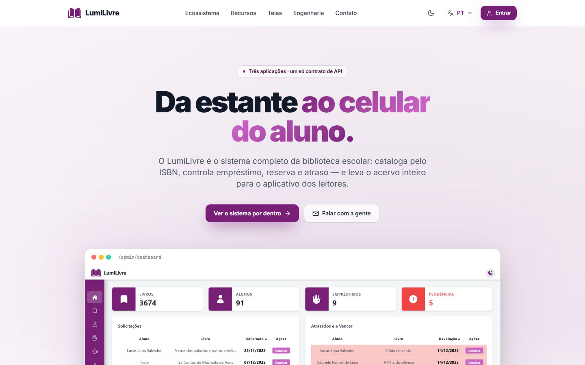
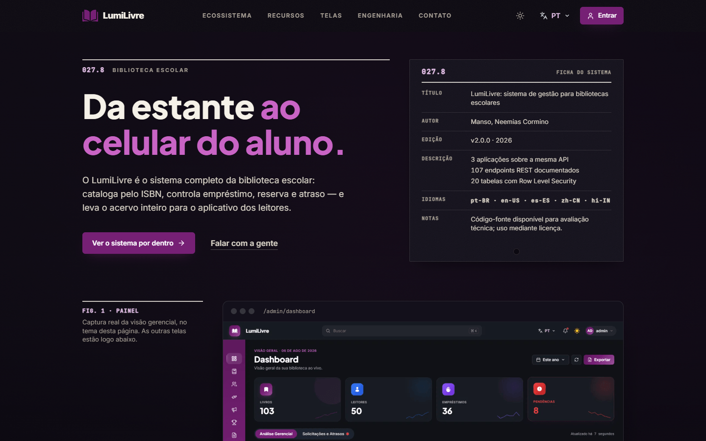
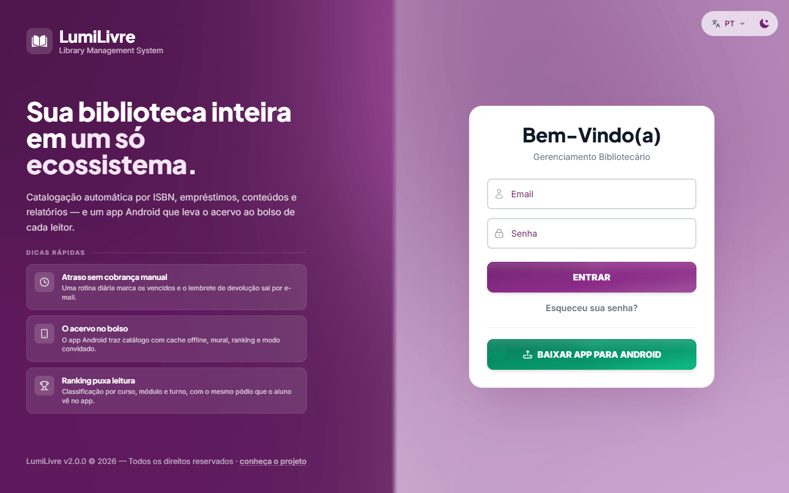
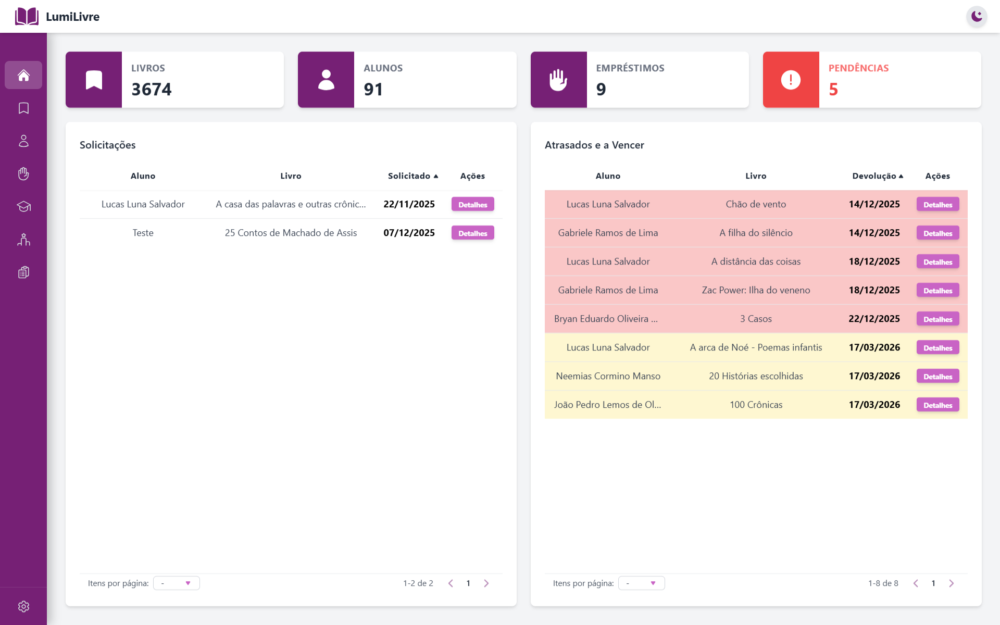
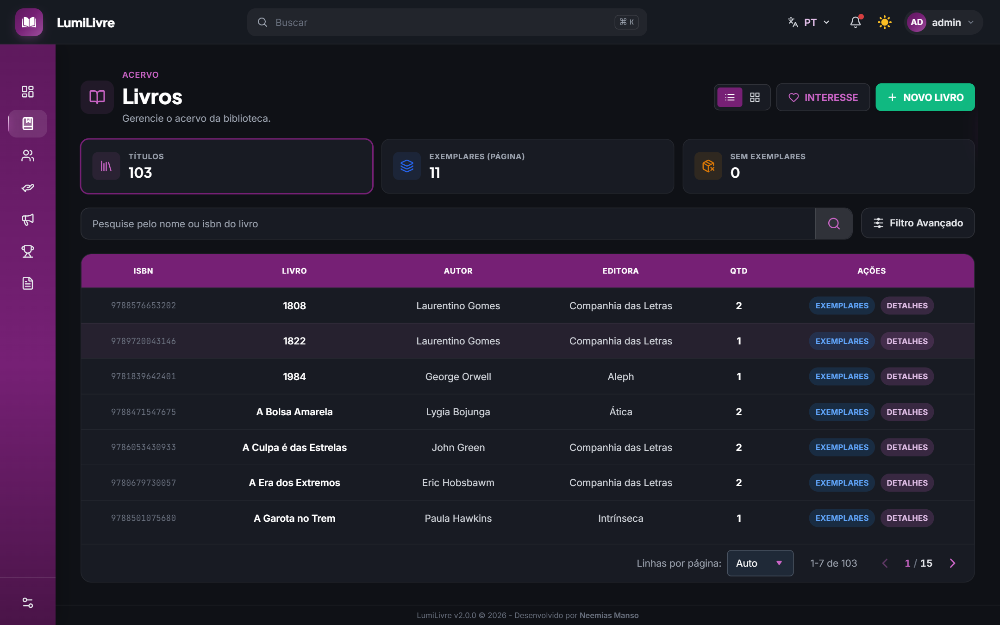
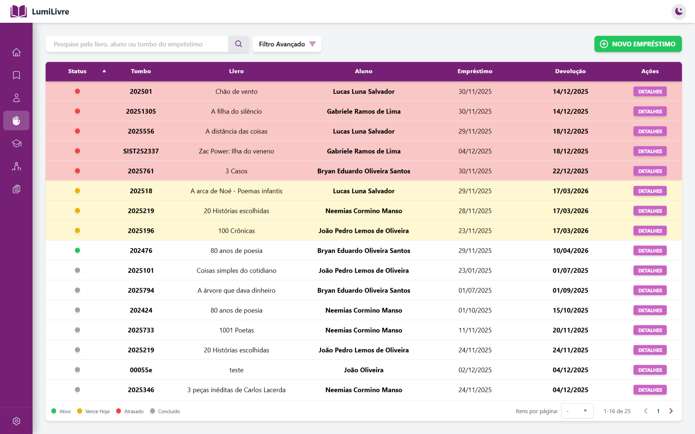
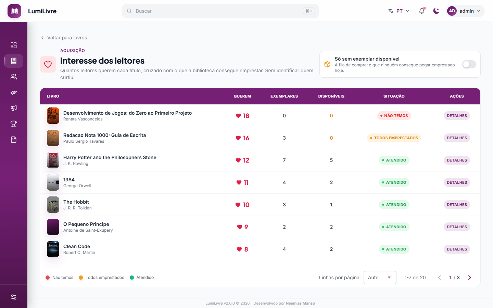
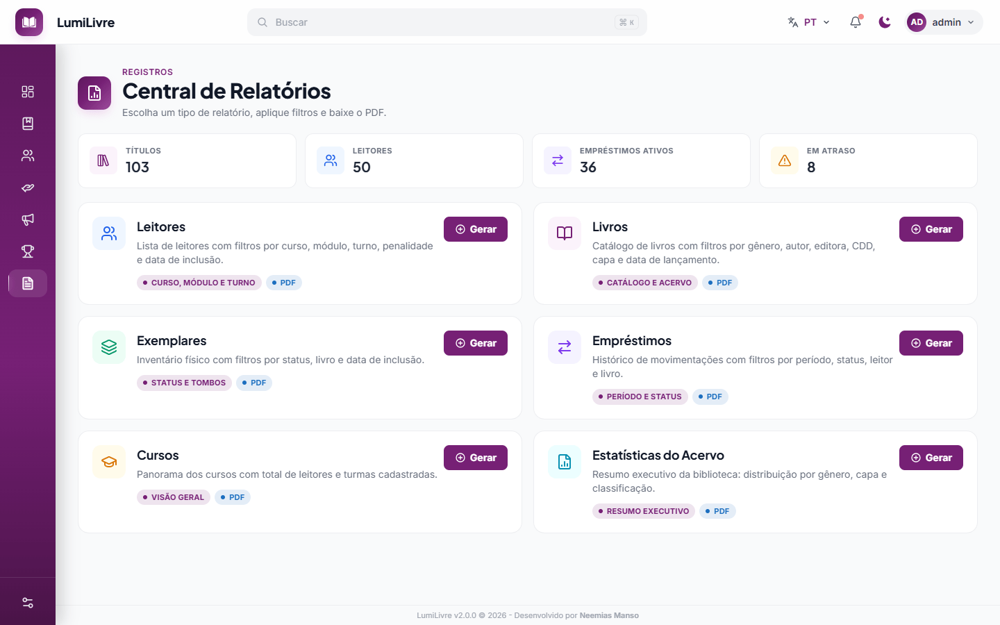
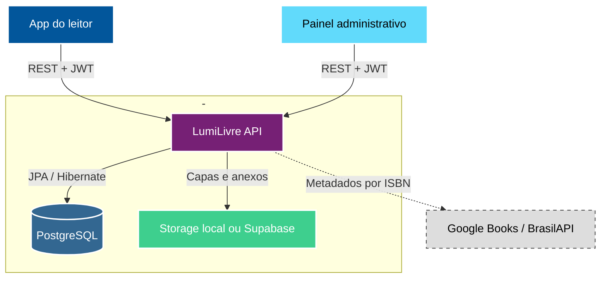

<div align="center">
  <!-- Banner -->
  <a href="https://n33miaz.github.io/n33miaz-links/#lumitcc"></a>

  <!-- Pins-->
  <a href="https://github.com/n33miaz/lumilivre-web"></a>
  <a href="https://github.com/n33miaz/lumilivre-app"></a>
  <a href="https://github.com/n33miaz/lumilivre-api"></a>
</div>

<br/>

<div align="center">


</div>

<br/>

<div align="center">
  <h1>LumiLivre Web</h1>
  <p><em>Painel administrativo e landing pública do ecossistema LumiLivre.</em></p>
</div>

O **LumiLivre Web** é a interface de trabalho de bibliotecários e gestores:
catalogar o acervo, controlar exemplares, movimentar empréstimos, aprovar
solicitações do app, publicar avisos no mural e acompanhar o dashboard. Inclui
também a landing pública e a página de download do app.

Construído em React 19 com TypeScript estrito, TanStack Query para estado remoto
e Tailwind para estilo. A interface é bilíngue (português e inglês) com mais três
idiomas parciais.

<br/>

<div align="center">
  <h1>Screenshots</h1>
</div>

Capturas do stack local rodando com o seed de demonstração — nenhuma tela é
mock. As da vitrine da landing ficam em `src/assets/images/prints/` (o build as
consome); as demais, em `docs/screenshots/`.

<div align="center">
  
  
</div>
<div align="center">
  
  
</div>
<div align="center">
  
  
</div>
<div align="center">
  
  
</div>

## Stack

| Camada | Tecnologia |
|--------|------------|
| Linguagem | TypeScript 5.8 (strict) |
| UI | React 19.1 + Vite 6.3 |
| Roteamento | React Router DOM 7.6 com `ProtectedRoute` e `RoleProtectedRoute` |
| HTTP | Axios 1.12 (`src/services/api.ts`) |
| Estado remoto | TanStack Query 5.90 |
| Formulários | React Hook Form 7.71 + Zod 4.3 |
| Estilo | TailwindCSS 3.4, Framer Motion, SVGR |
| Gráficos | Recharts 3.4 |
| Exportação | ExcelJS (XLSX) e jsPDF |
| i18n | i18next 26 + react-i18next 17, com detector de idioma |
| Efeitos | OGL (fundo WebGL da tela de login) |
| Ícones | Lucide |
| Testes | Vitest 4, Testing Library, jsdom, Playwright + `@axe-core` |
| Qualidade | ESLint 9, Prettier 3.6 |

## Rodando local

Requer Node 20 (versão usada no CI e na imagem Docker) e uma API acessível.

```powershell
npm install
Copy-Item .env.example .env    # aponte VITE_API_BASE_URL para a sua API
npm run dev                    # http://localhost:5173
```

Se você não quer subir a API à mão, o `docker-compose.yml` do repositório de
orquestração [`lumilivre`](https://github.com/n33miaz/lumilivre) levanta
PostgreSQL, API e este painel já populados com dados de demonstração:

```powershell
docker compose up -d --build   # painel em http://localhost:5173
```

Credenciais de demonstração do stack local: `admin` / `admin`.

### Scripts

| Comando | O que faz |
|---------|-----------|
| `npm run dev` | Servidor de desenvolvimento (5173) |
| `npm run build` | Typecheck (`tsc -b`) e build de produção |
| `npm run preview` | Serve o build em 4173 |
| `npm start` | Serve `dist/` com `serve` |
| `npm test` | Vitest em watch |
| `npm run test:coverage` | Vitest com cobertura |
| `npm run test:e2e` | Playwright — **exige `npm run build` antes** |
| `npm run lint` | ESLint |

## Configuração

Variáveis resolvidas em **tempo de build** — o Vite embute o valor no bundle,
então cada ambiente precisa do seu próprio build:

| Variável | Uso |
|----------|-----|
| `VITE_API_BASE_URL` | URL base da API (ex.: `http://localhost:8080`) |
| `VITE_APK_URL` | Endereço do APK do app (asset de GitHub Release). Opcional: sem ela, `/download` mostra aviso e link das releases |

No Docker elas entram como build args:

```powershell
docker build `
  --build-arg VITE_API_BASE_URL=https://sua-api.exemplo.com `
  --build-arg VITE_APK_URL=https://github.com/n33miaz/lumilivre-app/releases/latest/download/lumilivre.apk `
  -t lumilivre-web .
docker run -p 5173:80 lumilivre-web
```

A imagem é multi-stage: build com Node, runtime em nginx servindo a SPA com
fallback de rota, gzip (inclusive os `.gz` pré-comprimidos do build), cache
imutável nos assets com hash, `no-cache` no `index.html` e os cabeçalhos de
segurança.

O `nginx.conf` é instalado como **template**: o entrypoint da imagem oficial roda
`envsubst` na subida e injeta a origem da API no `connect-src` da CSP, a partir
do mesmo build arg que o bundle usa. Cabeçalhos servidos:

| Cabeçalho | Valor |
|-----------|-------|
| `Content-Security-Policy` | `default-src 'self'` com `script-src 'self'` (sem `unsafe-inline`/`unsafe-eval`), fontes do Google liberadas, imagens só por HTTPS e `connect-src` na API |
| `Strict-Transport-Security` | `max-age=31536000; includeSubDomains` (`preload` comentado — só com registro em hstspreload.org) |
| `X-Frame-Options` · `X-Content-Type-Options` · `Referrer-Policy` · `Permissions-Policy` | `DENY` · `nosniff` · `strict-origin-when-cross-origin` · câmera/microfone/localização negados |

> ⚠️ Produção precisa servir pela **imagem nginx**. `npm start` (`serve -s dist`)
> é só conveniência local: não aplica nenhum destes cabeçalhos.

### App Android (APK)

O binário **não é versionado** aqui — 56 MB dentro do git inflavam todo clone e
todo build. Ele é publicado como release do
[`lumilivre-app`](https://github.com/n33miaz/lumilivre-app) e o site só aponta
para lá (`/download`, botão do login e Configurações → Aplicativo).

Para publicar uma versão nova:

1. Gere o APK assinado no repositório do app
   (`flutter build apk --release --obfuscate --split-debug-info=build/symbols`).
2. Crie a release no `lumilivre-app` com a tag da versão e anexe o arquivo
   **com o nome `lumilivre.apk`**:
   ```powershell
   gh release create v2.1.0 build/app/outputs/flutter-apk/app-release.apk `
     --repo n33miaz/lumilivre-app --title "LumiLivre App v2.1.0"
   ```
3. Rebuild do web apontando `VITE_APK_URL` para o asset. Usando
   `releases/latest/download/lumilivre.apk`, o endereço segue valendo para as
   próximas releases e não precisa de novo build a cada versão.
4. Atualize a versão mínima em Configurações → Aplicativo se a release for
   obrigatória (força update no app).

## Funcionalidades

**Acervo** — cadastro de livros com busca automática de metadados por ISBN,
gestão de exemplares físicos com tombo e localização, gêneros e classificação
Dewey.

**Leitores** — cadastro completo com endereço por CEP, curso, turno e módulo
acadêmico; foto de perfil; histórico de empréstimos por leitor.

**Empréstimos** — registro de retirada e devolução com cálculo de datas,
renovação, aprovação e rejeição das solicitações vindas do app, e penalidade
automática por atraso.

**Mural** — publicação de avisos e trabalhos acadêmicos para o app do leitor,
com controle de público (todos, curso, módulo ou turno), destaque e janela de
publicação.

**Dashboard** — métricas agregadas servidas por views materializadas da API,
gráficos Recharts e exportação em XLSX e PDF.

**Relatórios** — PDF de acervo, leitores e movimentações.

**Administração** — usuários e papéis, configurações da biblioteca, versão
mínima do app, e visualizadores da trilha de acessos e da auditoria de negócio.

## Arquitetura


```mermaid
flowchart TD
    classDef mobile fill:#02569B,stroke:#fff,stroke-width:2px,color:#fff;
    classDef web fill:#61DAFB,stroke:#fff,stroke-width:2px,color:#000;
    classDef api fill:#762075,stroke:#fff,stroke-width:2px,color:#fff;
    classDef db fill:#336791,stroke:#fff,stroke-width:2px,color:#fff;
    classDef storage fill:#3ECF8E,stroke:#fff,stroke-width:2px,color:#fff;
    classDef external fill:#ddd,stroke:#333,stroke-width:1px,color:#000,stroke-dasharray: 5 5;

    UserMobile["App do leitor"]:::mobile
    UserWeb["Painel administrativo"]:::web

    subgraph Cloud["-"]
        direction TB
        API["LumiLivre API"]:::api
        DB[("PostgreSQL")]:::db
        Storage["Storage local ou Supabase"]:::storage
    end

    External["Google Books / BrasilAPI"]:::external

    UserMobile -->|REST + JWT| API
    UserWeb -->|REST + JWT| API

    API -->|JPA / Hibernate| DB
    API -->|Capas e anexos| Storage
    API -.->|Metadados por ISBN| External
```

### Estrutura

```
src/
  App.tsx · main.tsx
  api/               (mutator Axios)
  components/        (ui, shared, ErrorBoundary, QueryErrorBridge, RoleProtectedRoute)
  contexts/          (AuthContext, ThemeContext, ToastContext, LocaleContext)
  features/          (admin, books, contents, landing, loans, readers, users)
  hooks/             (queries/, mutations/)
  i18n/              (locales/, configuração e detector)
  layouts/
  pages/             (Auth, Books, Conteudos, Dashboard, Download, Landing,
                      Loans, Ranking, Readers, Reports, Settings)
  schemas/           (Zod)
  services/          (camada HTTP)
  types/
  utils/             (errorHandler, queryErrorHandler, roleCapabilities, dashboardExport)
e2e/                 (Playwright: navegação, auth, tema, acessibilidade)
```

Rotas administrativas: `/admin/dashboard`, `/admin/books`, `/admin/readers`,
`/admin/loans`, `/admin/contents`, `/admin/ranking`, `/admin/reports`,
`/admin/settings`. Públicas: `/`, `/login`, `/forgot-password`,
`/change-password`, `/download`.

## Idiomas

Português e inglês estão completos nos 14 namespaces. Espanhol, mandarim e hindi
traduzem o *chrome* da interface (`common` e `nav`) e caem para inglês e depois
português no restante, configurado via `fallbackLng` — nenhuma chave crua aparece
na tela. As fontes Noto para CJK e devanágari são carregadas como fallback no
`index.html`.

## Qualidade

- **Guardas por papel** — `RoleProtectedRoute` e `roleCapabilities` filtram rotas
  e itens de menu conforme o perfil (ADMIN, BIBLIOTECARIO, LEITOR).
- **Tratamento unificado de erro** — `ErrorBoundary`, `QueryErrorBridge` e
  `queryErrorHandler` categorizam falhas em validação, autorização, rede e
  inesperado; erro de rede não desloga o usuário.
- **Tema claro e escuro** nativo.
- **Performance** — paginação dinâmica pela altura disponível, cache do TanStack
  Query e lazy loading das rotas.
- **Peso dos assets** — imagem importada com `?picture` sai do build em WebP
  (1440px) com PNG de fallback via `<picture>`, e os assets de texto ganham `.gz`
  em nível 9 que o nginx serve direto. Vale por convenção: qualquer arquivo novo
  em `assets/images/prints/` entra no pipeline sem tocar na configuração.
- **Acessibilidade** — bateria `@axe-core/playwright` sobre a landing, o login e
  as quatro telas administrativas principais.
- **Segurança de sessão** — o cache de queries é limpo no logout para que dados
  de um usuário não vazem para o próximo em máquina compartilhada.

## Licença

**Proprietário — todos os direitos reservados.** Veja [`LICENSE`](LICENSE). O
código é publicado para leitura, estudo e avaliação técnica; qualquer uso, cópia
ou execução em produção requer licença comercial — **ncormino@gmail.com**.

<br/>

<div align="center">
  <sub>LumiLivre © 2026 — Gestão de bibliotecas escolares · Todos os direitos reservados.</sub>
</div>
