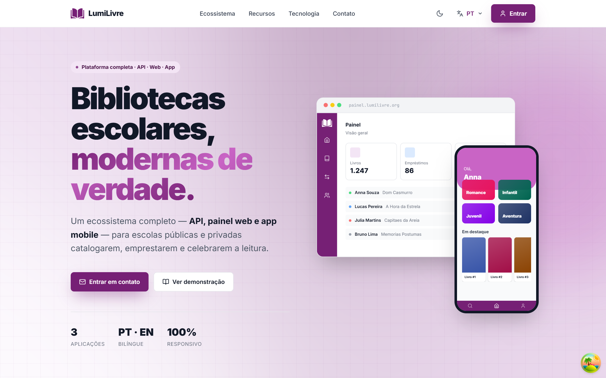
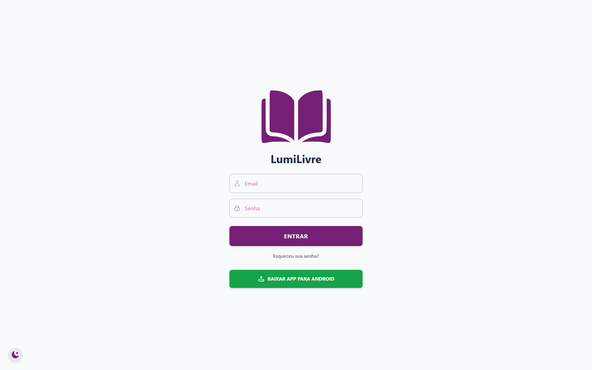
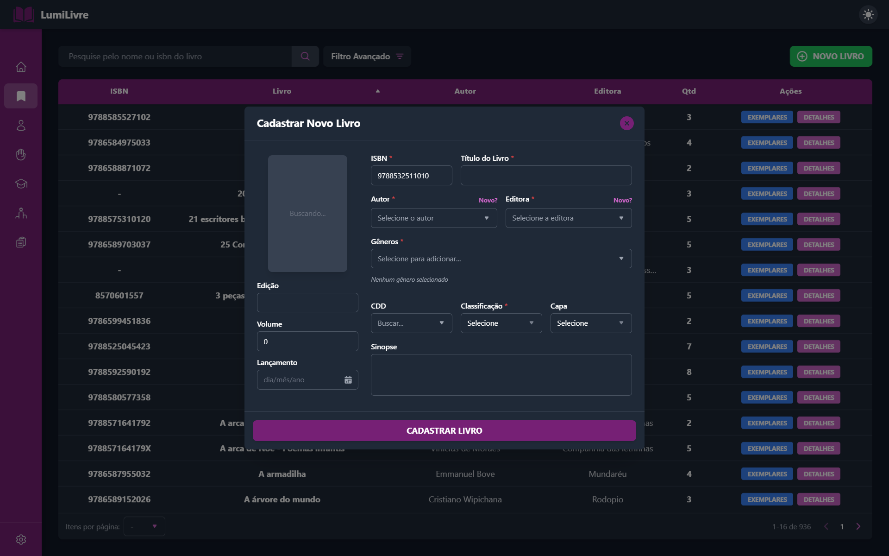
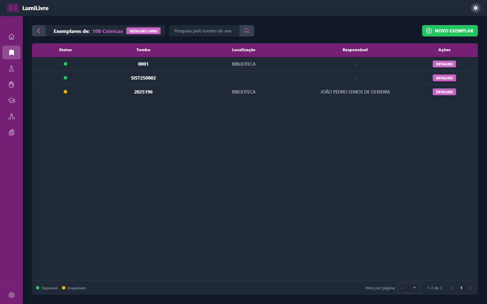
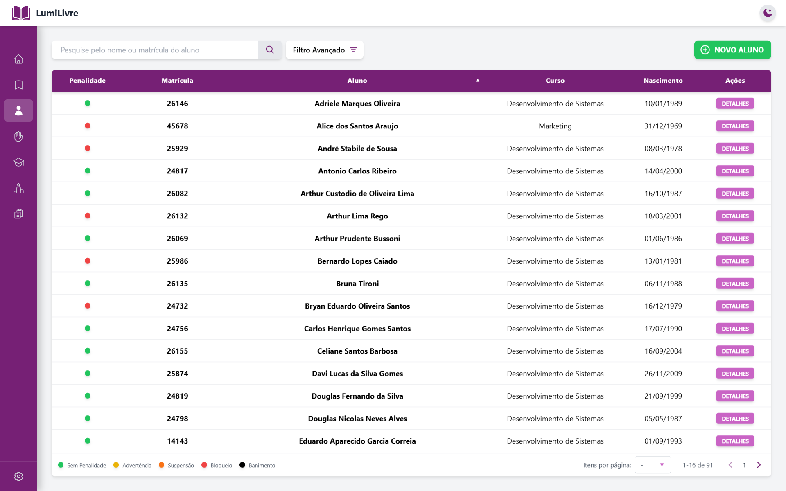
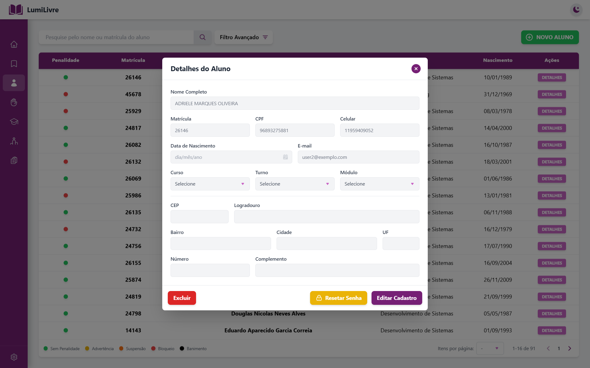
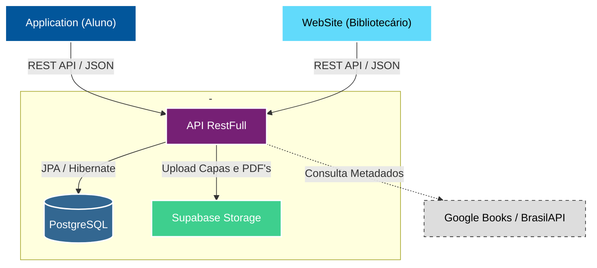

<div align="center">
  <!-- Banner -->
  <a href="https://n33miaz.github.io/n33miaz-links/#lumitcc"></a>

  <!-- Pins-->
  <a href="https://n33miaz.github.io/n33miaz-links/#lumiweb"></a>
  <a href="https://n33miaz.github.io/n33miaz-links/#lumiapp"></a>
  <a href="https://n33miaz.github.io/n33miaz-links/#lumiapi"></a>
</div>

<br/>

<div align="center">


</div>

<br/>

<div align="center">
  <h1>Sobre o Projeto</h1>
</div>

O **LumiLivre Web** é o painel administrativo central do ecossistema, voltado para **bibliotecários e gestores**. Desenvolvido em **React** com **TypeScript**, ele oferece uma interface robusta e responsiva para o gerenciamento completo do acervo, usuários e fluxo de empréstimos.

A aplicação foi construída com foco em produtividade, utilizando **TailwindCSS** para estilização moderna e **React Query** para gerenciamento eficiente de estado e cache, garantindo que os dados administrativos estejam sempre sincronizados com o backend.

<br/>

<div align="center">
  <h1>Screenshots</h1>
</div>

<div align="center">
  
</div>
<div align="center">
  
  
</div>
<div align="center">
  
  
</div>
<div align="center">
  
  
</div>

<br/>

<div align="center">
  <h1>Stack Técnica</h1>
</div>

| Camada | Tecnologia |
|--------|------------|
| Linguagem | TypeScript 5.8 (strict) |
| UI | React 19.1 + Vite 6.3 |
| Roteamento | React Router DOM 7.6 com `RoleProtectedRoute` |
| HTTP | Axios 1.12 (`src/api/mutator.ts`) |
| Estado remoto | TanStack Query 5.90 |
| Formulários | React Hook Form 7.71 + Zod 4.3 |
| Estilo | TailwindCSS 3.4, Framer Motion, Lottie, SVGR |
| Dados | Recharts 3.4 (gráficos) + export CSV/PDF |
| Testes | Vitest 4, Testing Library, jsdom, **Playwright + @axe-core** |
| Contratos | **Orval** (codegen a partir de `/v3/api-docs`) |
| Qualidade | ESLint 9, Prettier 3.6 |

<br/>

<div align="center">
  <h1>Funcionalidades Principais</h1>
</div>

### 📊 Dashboard & Gestão

- **Dashboard analítico** com Recharts (barras/pizza), export **CSV e PDF**, métricas agregadas por views materializadas da API.
- **Controle de Acervo:** cadastro completo de livros (busca automática por ISBN), exemplares físicos e TCCs.
- **Gestão de Usuários:** administração de alunos, cursos, turnos e módulos, com histórico detalhado por leitor.

### 🔄 Fluxo de Empréstimos

- **Solicitações e Reservas:** aprovação/rejeição de pedidos mobile; reservas FIFO quando não há exemplar disponível.
- **Movimentação:** registro de retiradas e devoluções, com cálculo automático de datas.
- **Penalidades:** bloqueio automático para alunos com devoluções em atraso.

### 📑 Relatórios & Ferramentas

- **Relatórios PDF** para acervo, alunos e movimentações.
- **Ranking** de leitores.
- **Importação em Massa** via planilhas Excel.

### ⚙️ Recursos Técnicos

- **Guardas por papel:** `RoleProtectedRoute` + `roleCapabilities` filtram rotas e menus conforme o perfil (ADMIN / BIBLIOTECARIO / ALUNO).
- **UX unificada de erro:** `ErrorBoundary`, `QueryErrorBridge` e `queryErrorHandler` categorizam erros em validação/autorização/rede/inesperado.
- **Dark Mode** nativo (`ThemeContext`).
- **Performance:** paginação dinâmica, cache TanStack Query e lazy loading de rotas.
- **Acessibilidade:** bateria `@axe-core/playwright` em 5 rotas críticas (Login, Dashboard, Livros, Alunos, Empréstimos).
- **Contratos gerados:** `orval.config.ts` materializa tipos e hooks React Query a partir do OpenAPI da API.

<br/>

<div align="center">
  <h1>Arquitetura do Sistema</h1>
</div>

Utilizamos uma arquitetura cliente-servidor moderna baseada em microsserviços e nuvem para garantir escalabilidade.


```mermaid
flowchart TD
    classDef mobile fill:#02569B,stroke:#fff,stroke-width:2px,color:#fff;
    classDef web fill:#61DAFB,stroke:#fff,stroke-width:2px,color:#000;
    classDef api fill:#762075,stroke:#fff,stroke-width:2px,color:#fff;
    classDef db fill:#336791,stroke:#fff,stroke-width:2px,color:#fff;
    classDef storage fill:#3ECF8E,stroke:#fff,stroke-width:2px,color:#fff;
    classDef external fill:#ddd,stroke:#333,stroke-width:1px,color:#000,stroke-dasharray: 5 5;

    UserMobile["Application (Aluno)"]:::mobile
    UserWeb["WebSite (Bibliotecário)"]:::web

    subgraph Cloud["-"]
        direction TB
        API["API RestFull"]:::api
        DB[("PostgreSQL")]:::db
        Storage["Supabase Storage"]:::storage
    end

    External["Google Books / BrasilAPI"]:::external

    UserMobile -->|REST API / JSON| API
    UserWeb -->|REST API / JSON| API

    API -->|JPA / Hibernate| DB
    API -->|Upload Capas e PDF's| Storage
    API -.->|Consulta Metadados| External
```

### Estrutura interna

```
src/
  App.tsx · main.tsx
  components/        (ui, shared, ErrorBoundary, QueryErrorBridge, RoleProtectedRoute)
  contexts/          (AuthContext, ThemeContext, ToastContext)
  features/          (books, loans, students, tcc)
  hooks/             (queries/, mutations/)
  layouts/
  pages/             (Auth, Books, Loans, Students, Start, TCC, Ranking, Reports, Settings, Download)
  schemas/           (Zod)
  services/          (camada HTTP; em migração para src/api gerado)
  utils/             (errorHandler, queryErrorHandler, roleCapabilities, dashboardExport)
  api/               (mutator Axios + tipos/hooks gerados pelo Orval)
e2e/                 (Playwright + a11y)
```

<br/>

<div align="center">
  <h1>Segurança</h1>
</div>

- **Rotas protegidas** com `ProtectedRoute` + **perfil** com `RoleProtectedRoute`.
- **Gestão de Sessão** via `AuthContext` (token em `sessionStorage`, logout automático em 401/403).
- **Validação de Dados** rigorosa (React Hook Form + Zod) antes de cada request.
- **Variáveis de ambiente**: `.env.example` documenta `VITE_API_BASE_URL`.

<br/>

<div align="center">
  <h1>Como rodar localmente</h1>
</div>

```powershell
# 1. Variáveis de ambiente
copy .env.example .env
# Preencha VITE_API_BASE_URL (ex.: http://localhost:8080)

# 2. Instalar e subir
npm install
npm run dev            # dev server em http://localhost:5173

# 3. Testes
npm run lint
npm test
npm run test:coverage
npm run test:e2e

# 4. Codegen de tipos a partir do OpenAPI da API
npm run api:gen

# 5. Build
npm run build
npm start              # servir /dist com serve
```

<br/>

<div align="center">
  <h1>Licença</h1>
</div>

**Proprietário — Todos os direitos reservados.** O código-fonte é público apenas para leitura, estudo e avaliação. Qualquer uso, cópia, modificação ou execução em produção requer licença comercial mediante negociação. Veja [`LICENSE`](LICENSE). Interessados: **ncormino@gmail.com**.

<br/>

<div align="center">
  <sub>LumiLivre © 2026 - Todos os direitos reservados.</sub>
</div>
